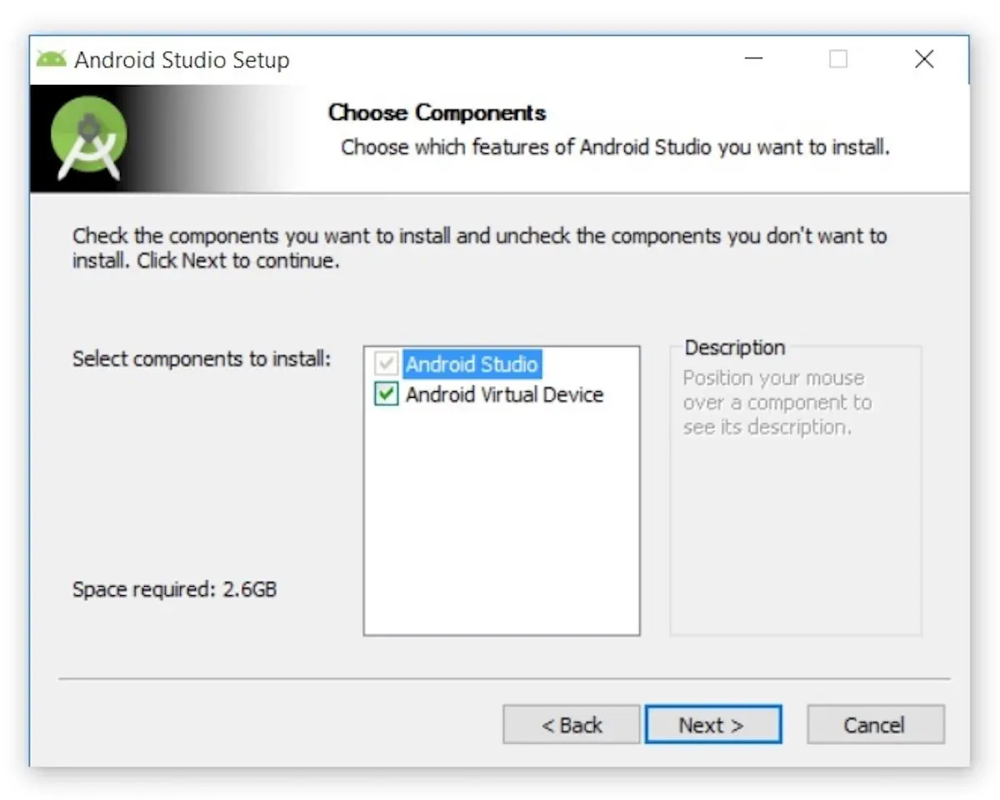

# Android Studio Installation And Usage

## Android Studio Installation

Go to the [Android Studio Website](https://developer.android.com/studio)

Download the latest version of Android Studio (This documentation is for installing Android Studio Koala)

Open the Android Studio Setup window

Ensure both Android Studio and Android Virtual Device will be installed

Choose the installation location

Complete the Android Studio Setup

Open Android Studio

Do/ Don’t import previous settings

Do/ Don’t send usage statistics to Google

Select standard setup type

Click Next

Accept all of the licenses

Click Finish

Wait for it to download

Click Finish

## Open The Fitness Logger App In Android Studio

Open Android Studio

Go to the Projects Screen

Click Open

Open the fitness logger directory

## Create A New Virtual Device In Android Studio

Click on Device Manager in the right-hand sidebar (An image of a phone behind a part of the Android logo)

Select the device you want to use

Select the System Image you want to use

Select the Preferred ABI

Choose the orientation

Select the Emulated Performance

Decide whether to use Device Frame

Click Finish

## Run The Fitness Logger App In Android Studio

To run the fitness logger app, ensure it is open in Android Studio

Click on the run button. This button is located in the toolbar on the right side of the device name